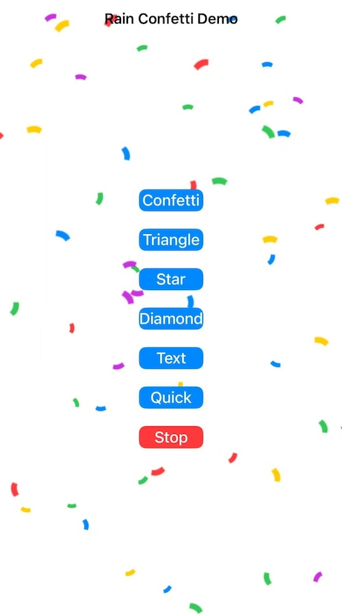

# RainConfetti 🎉

[](https://swift.org)
[](https://developer.apple.com)
[](LICENSE)

中文文档 | [English](README.md)

一个轻量级、高性能的 iOS 撒花动画库，支持多种粒子类型和自定义文字撒花效果。

## 特性

- ✨ 多种内置粒子类型（五彩纸屑、三角形、星星、钻石）
- 🔤 支持自定义文字撒花（每个字符独立动画）
- 🎨 自定义颜色和强度控制
- ⏱️ 可设置动画持续时间
- 🖼️ 支持自定义图片粒子
- 🎮 完整的动画控制（开始、停止、暂停、恢复）
- 📱 纯 Swift 实现，支持 iOS 13.0+

## 预览



## 安装

### Swift Package Manager

在Xcode中，选择 `File` > `Add Package Dependencies`，然后输入：

https://github.com/linghugoogle/RainConfetti

### CocoaPods

```ruby
pod 'RainConfetti'
```

然后运行：

```bash
pod install
```

### 手动安装

将 `RainConfettiView.swift` 文件拖入你的项目中。

## 快速开始

### 基础用法

```swift
import UIKit

class ViewController: UIViewController {
    override func viewDidLoad() {
        super.viewDidLoad()

        // 创建撒花视图
        let confettiView = RainConfettiView(frame: view.bounds)
        confettiView.intensity = 0.7
        view.addSubview(confettiView)

        // 开始撒花
        confettiView.startConfetti()
    }
}
```

### 快速撒花

```swift
// 一行代码实现撒花效果
RainConfettiView.showConfetti(
    in: view,
    type: .confetti,
    colors: [.systemRed, .systemBlue, .systemGreen],
    intensity: 0.8,
    duration: 3.0
)
```

## 详细用法

### 粒子类型

```swift
// 五彩纸屑
confettiView.type = .confetti

// 三角形
confettiView.type = .triangle

// 星星
confettiView.type = .star

// 钻石
confettiView.type = .diamond

// 文字撒花
confettiView.type = .text("恭喜发财", UIFont.systemFont(ofSize: 24, weight: .bold))

// 自定义图片
confettiView.type = .custom(UIImage(named: "custom_particle")!)
```

### 自定义配置

```swift
let confettiView = RainConfettiView(frame: view.bounds)

// 设置颜色
confettiView.colors = [
    .systemRed,
    .systemBlue,
    .systemGreen,
    .systemYellow,
    .systemPurple
]

// 设置强度 (0.0 - 1.0)
confettiView.intensity = 0.5

// 设置持续时间（0 表示不自动停止）
confettiView.duration = 5.0

// 开始动画
confettiView.startConfetti()
```

### 动画控制

```swift
// 开始撒花
confettiView.startConfetti()

// 停止撒花
confettiView.stopConfetti()

// 暂停动画
confettiView.pauseConfetti()

// 恢复动画
confettiView.resumeConfetti()

// 检查是否正在播放
if confettiView.isActive() {
    print("撒花进行中...")
}
```

### 文字撒花

文字撒花是 RainConfetti 的特色功能，每个字符都会作为独立的粒子进行动画：

```swift
// 中文撒花
confettiView.type = .text("新年快乐", UIFont.systemFont(ofSize: 28, weight: .bold))
confettiView.colors = [.red, .gold, .orange, .yellow]

// Emoji 撒花
confettiView.type = .text("🎉🎊🥳🎈", UIFont.systemFont(ofSize: 32))

// 英文撒花
confettiView.type = .text("HAPPY", UIFont.systemFont(ofSize: 24, weight: .heavy))
```

## API 文档

### RainConfettiView

#### 属性

| 属性          | 类型             | 描述                      |
| ------------- | ---------------- | ------------------------- |
| `type`      | `ConfettiType` | 粒子类型                  |
| `colors`    | `[UIColor]`    | 粒子颜色数组              |
| `intensity` | `Float`        | 撒花强度 (0.0-1.0)        |
| `duration`  | `TimeInterval` | 持续时间，0表示不自动停止 |

#### 方法

| 方法                 | 描述             |
| -------------------- | ---------------- |
| `startConfetti()`  | 开始撒花动画     |
| `stopConfetti()`   | 停止撒花动画     |
| `pauseConfetti()`  | 暂停动画         |
| `resumeConfetti()` | 恢复动画         |
| `isActive()`       | 检查是否正在播放 |

#### 类方法

```swift
static func showConfetti(
    in view: UIView,
    type: ConfettiType = .confetti,
    colors: [UIColor]? = nil,
    intensity: Float = 0.5,
    duration: TimeInterval = 3.0
) -> RainConfettiView
```

### ConfettiType

```swift
public enum ConfettiType {
    case confetti                           // 五彩纸屑
    case triangle                          // 三角形
    case star                              // 星星
    case diamond                           // 钻石
    case text(String, UIFont? = nil)       // 文字
    case custom(UIImage)                   // 自定义图片
}
```

## 系统要求

- iOS 13.0+
- Xcode 12.0+
- Swift 5.0+

## 示例项目

克隆仓库并运行示例项目：

```bash
git clone https://github.com/linghugoogle/RainConfetti.git
cd RainConfetti
open RainConfetti.xcodeproj
```

## 贡献

欢迎提交 Issue 和 Pull Request！

1. Fork 这个项目
2. 创建你的特性分支 (`git checkout -b feature/AmazingFeature`)
3. 提交你的更改 (`git commit -m 'Add some AmazingFeature'`)
4. 推送到分支 (`git push origin feature/AmazingFeature`)
5. 打开一个 Pull Request

## 许可证

本项目采用 MIT 许可证 - 查看 [LICENSE](LICENSE) 文件了解详情。

## 作者

- **liyanbin** - [GitHub](https://github.com/linghugoogle)

## 致谢

- 感谢所有贡献者
- 灵感来源于庆祝动画的需求

---

如果这个项目对你有帮助，请给个 ⭐️ 支持一下！
